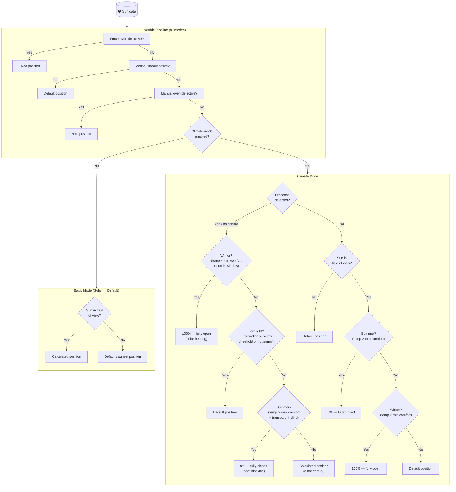

# Adaptive Cover Pro

This Custom-Integration provides sensors for vertical and horizontal blinds based on the sun's position by calculating the position to filter out direct sunlight.

This integration builds upon the template sensor from this forum post [Automatic Blinds](https://community.home-assistant.io/t/automatic-blinds-sunscreen-control-based-on-sun-platform/)

## Table of Contents

- [Features](#features)
- [Installation](#installation)
  - [HACS (Recommended)](#hacs-recommended)
  - [Manual](#manual)
- [Migrating from Adaptive Cover](#migrating-from-adaptive-cover)
- [Setup](#setup)
- [Cover Types](#cover-types)
- [Modes](#modes)
  - [Basic mode](#basic-mode)
  - [Climate mode](#climate-mode)
    - [Climate strategies](#climate-strategies)
- [Variables](#variables)
  - [Common](#common)
  - [Vertical](#vertical)
  - [Horizontal](#horizontal)
  - [Tilt](#tilt)
  - [Automation](#automation)
  - [Climate](#climate)
  - [Blindspot](#blindspot)
- [Entities](#entities)
- [Known Limitations & Best Practices](#known-limitations--best-practices)
- [Configuration Summary](#configuration-summary)
- [Troubleshooting](#troubleshooting)
- [Enhanced Geometric Accuracy](#enhanced-geometric-accuracy)
- [Testing the Algorithms](#testing-the-algorithms)
- [Simulation Notebook](#simulation-notebook--visualize-your-actual-configuration)
- [Credits](#credits)
- [For Developers](#for-developers)

## Features

- Individual service devices for `vertical`, `horizontal` and `tilted` covers
- Two mode approach with multiple strategies [Modes(`basic`,`climate`)](https://github.com/jrhubott/adaptive-cover-pro?tab=readme-ov-file#modes)
- Binary Sensor to track when the sun is in front of the window
- Sensors for `start` and `end` time
- Auto manual override detection
- Smart device naming - automatically suggests device names based on your cover entities
- Support for both position-capable and open/close-only covers
  - Automatic detection of cover capabilities at runtime
  - Configurable threshold for open/close decision (default 50%)

- **Climate Mode**

  - Weather condition based operation
  - Presence based operation
  - Switch to toggle climate mode
  - Sensor for displaying the operation modus (`winter`,`intermediate`,`summer`)

- **Adaptive Control**

  - Turn control on/off
  - Control multiple covers
  - Optional return to default position when automatic control is disabled
  - Set start time to prevent opening blinds while you are asleep
  - Set minimum interval time between position changes
  - Set minimum percentage change
  - **Force Override Sensors** - Weather safety protection
    - Configure binary sensors (rain, wind, etc.) that override automatic control
    - When ANY sensor is active, ALL covers move to a configured safe position
    - Default position: 0% (fully retracted/closed) for rain/wind protection
    - Customizable position: Set to 100% for security sensors (emergency access)
    - Manual control still works during force override
  - **Motion-Based Automatic Control** - Occupancy-based automation
    - Configure motion sensors to enable/disable sun positioning based on room occupancy
    - When ANY sensor detects motion, covers use automatic sun-based positioning
    - When ALL sensors show no motion for configured timeout, covers return to default position
    - Debouncing prevents position flapping from rapid sensor toggling (30-3600 seconds, default 300)
    - OR logic for multiple sensors - ANY room with motion enables automatic positioning
    - Use cases: Glare control when present, energy savings when away, privacy when unoccupied
    - Optional feature - leave sensor list empty to disable
  - **Automatic Position Verification** (built-in reliability feature)
    - Periodically verifies covers reached the positions we sent them to (every 2 minutes)
    - Automatically retries failed position commands (up to 3 attempts)
    - Detects position mismatches between target and actual position (3% tolerance)
    - Respects manual override detection and skips during active moves
    - Separate from normal position updates - only retries failed commands, doesn't chase sun movement
    - No configuration required - works automatically when automatic control is enabled
    - Diagnostic sensors available for troubleshooting cover movement issues

- **Diagnostic Sensors** (always enabled, no setup required)
  - Real-time troubleshooting sensors to understand integration behavior
  - All sensors use diagnostic entity category
  - 9 consolidated sensors covering all aspects of integration behavior:
    - **Sun Position** — azimuth, elevation, gamma, FOV bounds, in_fov in one sensor
    - **Control Status** — why covers are/aren't moving, delta thresholds, time since last action
    - **Calculated Position** — raw geometric position with `position_explanation` attribute showing the full decision chain (e.g. `"Sun tracking (45%) → Climate: Winter Heating → 100%"`)
    - **Last Cover Action** — most recent cover command with full details
    - **Manual Override End Time** — when automatic control will resume
    - **Position Verification** — last check time and retry count combined
    - **Motion Status** — motion control state; shows `not_configured` when no motion sensors are set up
    - **Climate Status** — active temperature and climate strategy combined (when climate mode enabled)
    - **Force Override Triggers** — count and per-sensor status (when force override sensors configured)

- **Enhanced Geometric Accuracy** (automatic improvements)
  - Angle-dependent safety margins for better sun blocking at extreme angles
  - Automatic edge case handling for very low/high sun elevations
  - Smooth transitions across all sun angles using interpolation
  - Optional window depth parameter for advanced precision
  - No configuration required - works automatically
  - Backward compatible - existing installations benefit immediately

- **Configuration Summary** (built-in review screen)
  - Shown at the end of initial setup before the entry is created
  - Also accessible any time from the options menu as **Configuration Summary**
  - Combines all settings into a single, plain-English view organized into four sections:
    - **Your Cover** — what is being controlled and the physical window dimensions
    - **How It Decides** — a narrative explanation of every active rule in priority order (sun tracking, timing, blind spot, glare zones, climate, cloud suppression, manual override, motion timeout, weather safety, force override)
    - **Position Limits** — default position, min/max range, delta thresholds, and flags like inverse state and interpolation — all on one line
    - **Decision Priority** — a compact one-line reference showing all 9 pipeline handlers with ✅ (active) or ❌ (not configured) status
  - Only configured features are shown — unconfigured sections are omitted to keep the summary concise

## Installation

### HACS (Recommended)

Add <https://github.com/jrhubott/adaptive-cover-pro> as custom repository to HACS.
Search and download Adaptive Cover Pro within HACS.

Restart Home-Assistant and add the integration.

### Manual

Download the `adaptive_cover_pro` folder from this github.
Add the folder to `config/custom_components/`.

Restart Home-Assistant and add the integration.

## Migrating from Adaptive Cover

Users migrating from AdaptiveCover will need to recreate their configurations manually. See [Setup](#setup) below for configuration steps.

## Setup

Adaptive Cover Pro supports (for now) three types of covers/blinds; `Vertical` and `Horizontal` and `Venetian (Tilted)` blinds.
Each type has its own specific parameters to setup a sensor. To setup the sensor you first need to find out the azimuth of the window(s). This can be done by finding your location on [Open Street Map Compass](https://osmcompass.com/).

During setup, the integration will automatically suggest a device name based on the first cover entity you select, prefixed with "Adaptive" (e.g., "Living Room Blind" becomes "Adaptive Living Room Blind"). You can modify this suggested name if desired.

**Enhanced Configuration UI:** The setup flow includes comprehensive descriptions for every configuration field, with practical examples, recommended values, and explanations of technical terms. Each field now provides context about why it matters and how it affects cover behavior, making configuration easier for both new and experienced users.

**Configuration Summary:** After completing all setup steps, a summary screen shows your entire configuration in plain English before the entry is created. It explains what your cover will control, how each active rule works, and shows the full override priority chain at a glance. The same summary is always accessible from the options menu under **Configuration Summary** — useful when reviewing or troubleshooting a cover's behavior.

Example summary output:

```
Your Cover
Vertical Blind controlling cover.living_room_blind
2.1m tall window, blocking sun 0.5m from the glass

How It Decides
☀️ Tracks the sun (azimuth 180°, ±90°/90° field of view) and calculates position
   to block direct sunlight.
🕒 from 07:30 until 20:00. After end time/sunset → 0%.
✋ Manual override: pauses automatic control when you move the cover
   (pauses for 120 min, threshold 5%, resets on next move).
🌡️ Climate mode: adjusts strategy for heating/cooling
   (comfort range 16–24°C, using sensor.indoor_temp, weather: weather.home).
☁️ Cloud suppression: skips sun tracking when lux < 1000 lx → default (60%).
🌧️ Weather safety: if wind > 50 km/h → covers retract to 0% (waits 600s
   after clearing).
🔒 Force override: if any of 1 sensor is on → covers go to 100%
   (overrides everything else).

Position Limits
Range: 10%–95% (during sun tracking only) · Default: 60% · Min change: 2% ·
Min interval: 2 min · Inverse state · Interpolation on

Decision Priority (highest wins, ✅ active ❌ not configured)
✅Force(100) → ✅Weather(90) → ❌Motion(80) → ✅Manual(70) → ✅Cloud(60)
→ ✅Climate(50) → ❌Glare(45) → ✅Solar(40) → ✅Default(0)
```

## Cover Types

|              | Vertical                      | Horizontal                      | Tilted                          |
| ------------ | ----------------------------- | ------------------------------- | ------------------------------- |
|              |  |  |  |
| **Movement** | Up/Down                       | In/Out                          | Tilting                         |
|              | [variables](#vertical)        | [variables](#horizontal)        | [variables](#tilt)              |
| **Note**     |                               |                                 | For venetian blinds with both vertical and tilt capabilities, see [Known Limitations](#known-limitations--best-practices) |

## Modes

This component supports two calculation modes — **Basic** and **Climate** — both wrapped by a shared override pipeline. The pipeline evaluates handlers in priority order; the first handler that produces a result wins.

### Override pipeline

Regardless of which calculation mode is active, every position decision passes through the override pipeline:

| Priority | Override | Behavior |
|----------|----------|----------|
| 100 | **Force override** | Binary sensor(s) force cover to a fixed position — no other logic runs |
| 80 | **Motion timeout** | If all occupancy sensors report no motion for the configured timeout, cover returns to default position |
| 70 | **Manual override** | If the user physically moved the cover, automatic control is paused |
| 50 | **Climate** | Active when Climate mode is enabled — applies temperature/presence/light strategy (see below) |
| 40 | **Solar** | Active when sun is within the window's field of view and elevation limits — uses calculated sun-tracking position |
| 0 | **Default** | Final fallback — returns the configured default position (or sunset position if applicable) |

### Basic mode

The pipeline skips the Climate handler (priority 50). When the sun is within the configured field of view and above the minimum elevation, the integration uses the geometrically calculated blind position to block direct sunlight. Otherwise it falls back to the default position or the configured sunset position if the sun has set.

### Climate mode

> **⚠️ Start with Basic Mode First**
> Climate mode adds significant complexity with temperature thresholds, presence detection, and weather conditions. We recommend configuring Basic mode first and ensuring it works correctly before enabling Climate mode features.
>
> **Temperature Unit Consistency Required:** All temperature sensors must use the same unit system (°C or °F). The integration does not automatically convert between units. See [Known Limitations](#known-limitations--best-practices) for details.

Climate mode enables the Climate handler (priority 50), which takes precedence over solar tracking. It uses indoor temperature, presence, weather, and light sensors to choose a strategy. Decisions are made in priority order — the first matching condition wins.



#### Climate strategies

- **With Presence** (or no presence entity configured):
  The objective is to reduce glare while providing daylight. Conditions are evaluated in this priority order:

  1. **Winter heating**: Indoor temperature below the minimum comfort threshold and sun in front of the window → open to 100% for passive solar heating. Takes priority over all other conditions.
  2. **Low light**: Not summer, and light levels are low (lux/irradiance below threshold) or weather is not sunny → default position to maximise daylight.
  3. **Summer cooling**: Indoor temperature above the maximum comfort threshold **and the "Transparent blind" option is enabled** → close to 0% to block heat while still allowing diffused light through sheer fabric. If "Transparent blind" is off (opaque blind), this step is skipped and the calculated sun-tracking position is used instead.
  4. **Glare control**: All other conditions (comfortable temperature, sunny day) → calculated sun-tracking position.

- **Without Presence**:
  The objective is energy efficiency; glare and daylight are not considered.

  - Sun in front of window and summer → **0%** (block heat)
  - Sun in front of window and winter → **100%** (gain solar heat)
  - Otherwise → **default position**

**Transparent blind**: A "transparent blind" is a see-through cover — sheer curtains, light-filtering roller shades, or any fabric you can see through. Enable this option if your blind lets light through even when fully closed. With it enabled, the integration closes the blind fully in summer to block solar heat gain while still allowing diffused light into the room. Leave it disabled for blackout blinds, wooden blinds, or any opaque cover — those already block direct sun at the calculated position without needing to close fully.

> **Note:** The "Transparent blind" option only affects the *With Presence* path in Climate mode during summer conditions. The *Without Presence* path always closes to 0% in summer regardless of this setting.

**Weather integration**: A weather entity can be configured to identify sunny conditions (default states: `sunny`, `windy`, `partlycloudy`, `cloudy` — customisable). Winter heating (priority 1) activates regardless of weather or light levels.

**Tilted blinds**: Follow the same strategies, with these differences in summer mode: slats are set to 45° (found [optimal](https://www.mdpi.com/1996-1073/13/7/1731) for heat blocking while maintaining some light) when presence is detected, and to 0% (fully closed) when no presence is detected.

## Variables

### Common


| Variables                     | Default | Range | Description                                                                                              |
| ----------------------------- | ------- | ----- | -------------------------------------------------------------------------------------------------------- |
| Entities                      | []      |       | Denotes entities controllable by the integration                                                         |
| Window Azimuth                | 180     | 0-359 | The compass direction of the window, discoverable via [Open Street Map Compass](https://osmcompass.com/) |
| Default Position              | 60      | 0-100 | Initial position of the cover in the absence of sunlight glare detection                                 |
| Minimal Position              | 100     | 0-99  | Minimal opening position for the cover, suitable for partially closing certain cover types               |
| Maximum Position              | 100     | 1-100 | Maximum opening position for the cover, suitable for partially opening certain cover types               |
| Field of view Left            | 90      | 0-180 | Unobstructed viewing angle from window center to the left, in degrees                                    |
| Field of view Right           | 90      | 0-180 | Unobstructed viewing angle from window center to the right, in degrees                                   |
| Minimal Elevation             | None    | 0-90  | Minimal elevation degree of the sun to be considered                                                     |
| Maximum Elevation             | None    | 1-90  | Maximum elevation degree of the sun to be considered                                                     |
| Default position after Sunset | 0       | 0-100 | Cover's default position from sunset to sunrise                                                          |
| Offset Sunset time            | 0       |       | Additional minutes before/after sunset                                                                   |
| Offset Sunrise time           | 0       |       | Additional minutes before/after sunrise                                                                  |
| Inverse State                 | False   |       | Calculates inverse state for covers fully closed at 100%                                                 |

#### How to Measure Field of View

Field of View (FOV) defines the horizontal angular range where the integration actively tracks the sun. Outside this range the sun is treated as "not in front of the window" and the cover returns to the default position.

**Measurement steps:**
1. Stand at the centre of the window, inside your room, looking straight out (perpendicular to the wall — this is the azimuth direction).
2. Look left: find the furthest point where direct sunlight can enter through the window without being blocked by a wall, pillar, overhang, or neighbouring building. Estimate the angle between straight-ahead and that point. That is **FOV Left**.
3. Repeat looking right for **FOV Right**.
4. A smartphone protractor app (or a simple protractor held flat) makes this easier to measure accurately.

**Recommended values by situation:**

| Situation | FOV Left / Right |
|-----------|-----------------|
| Standard window, no obstructions | 45° each side |
| Wide window or sliding glass door | 60–75° each side |
| Narrow window or recessed into a thick wall | 30° each side |
| Protecting furniture or artwork from any direct sun | Measure actual unobstructed angle (see below) |

**Protecting fragile furniture or artwork:** The default 90° per side (180° total) is intentionally wide to work for most installations. However, if your goal is to prevent *any* direct sunlight from reaching a specific area, use the *actual* unobstructed angle your window allows — not the default. Measure from the window centre to the edge of whichever wall, column, or frame first blocks direct sun on each side. A tighter FOV means the blind engages as soon as direct sun could enter, and stays in the default (typically more closed) position at all other times.

**Example:** A south-facing window set into a 60 cm thick wall may only allow direct sun within ±40° of perpendicular. Setting FOV Left and FOV Right to 40° each ensures the blind is always active during those hours, rather than the wider 90° default which would leave gaps.

#### Position Limits: Min and Max Position

The Minimal Position and Maximum Position settings create boundaries for automatic cover control. Each limit has an associated toggle that controls **when** the limit applies:

**Apply min/max only during sun tracking** (toggles):
- **Unchecked (default, recommended)**: The position limit applies **ALL THE TIME** - during sun tracking, default position, climate modes, and all other states. The cover will never go below the minimum or above the maximum value.
- **Checked (advanced)**: The position limit **ONLY applies when the sun is directly in front of the window** during active sun tracking. During default/fallback states (sun behind window, outside tracking hours, etc.), the cover can go below minimum or above maximum values.

**Most users should leave these toggles UNCHECKED** for consistent protection and predictable behavior. The "checked" option is for advanced users who want limits to apply only during active sun tracking, allowing more flexibility during other times.

**Common use cases:**
- **Minimum Position** (e.g., 20%): Prevents cover from fully closing, maintains some natural light, protects from jamming at bottom
- **Maximum Position** (e.g., 80%): Prevents cover from fully opening, maintains some privacy/shade, protects from jamming at top

#### Position Interpolation (Range Adjustment)

Position Interpolation allows you to adjust how calculated positions (0-100%) map to actual cover positions sent to your devices. This is useful for covers with non-standard behavior or limited operating ranges.

**When to use:**
- Covers that don't respond across the full 0-100% range
- Covers that need inverted operation (alternative to `inverse_state`)
- Covers requiring non-linear position mapping

**Simple Mode** (Start/End values):

Configure two values to linearly map the 0-100% calculated range to a custom output range.

| Use Case | Configuration | Result |
|----------|---------------|--------|
| **Limited Range Cover** | Start: 10%, End: 90% | 0% calculated → 10% sent<br>100% calculated → 90% sent<br>50% calculated → 50% sent |
| **Inverted Operation** | Start: 100%, End: 0% | 0% calculated → 100% sent<br>100% calculated → 0% sent<br>50% calculated → 50% sent |
| **Offset Range** | Start: 20%, End: 80% | 0% calculated → 20% sent<br>100% calculated → 80% sent<br>50% calculated → 50% sent |

**Advanced Mode** (Point Lists):

For non-linear mappings, define custom control points. Useful for covers with aggressive closing behavior or custom position curves.

**Example - Aggressive Closing:**
```
Normal List:     [0, 25, 50, 75, 100]
Interpolated List: [0, 15, 35, 60, 100]
```

This mapping causes the cover to close more aggressively:
- 0% calc → 0% sent (no change)
- 25% calc → 15% sent (closes more)
- 50% calc → 35% sent (closes more)
- 75% calc → 60% sent (closes more)
- 100% calc → 100% sent (no change)

**Example - Inverted with Custom Curve:**
```
Normal List:     [0, 25, 50, 75, 100]
Interpolated List: [100, 75, 50, 25, 0]
```

**Important Notes:**
- Interpolation is applied **AFTER** position calculation and **BEFORE** sending to cover
- Works with both position-capable and open/close-only covers
- Cannot be used together with `inverse_state` (choose one or the other)
- List mode requires at least 2 points, values must be sorted ascending in Normal List

### Vertical


| Variables         | Default | Range | Description                                                                                 |
| ----------------- | ------- | ----- | ------------------------------------------------------------------------------------------- |
| Window Height     | 2.1     | 0.1-6   | Length of fully extended cover/window                                                       |
| Sill Height       | 0.0     | 0.0-3.0 | Height from floor to bottom of window glass (meters). Set for windows not starting at floor level. Allows the blind to open more, as the sill already blocks low-angle sun. |
| Window Depth      | 0.0     | 0.0-0.5 | Depth of window reveal/frame — distance from outer wall surface to glass (meters). Improves accuracy at oblique sun angles. See [Window Depth](#optional-window-depth) for details. |
| Glare Zone        | 0.5     | 0.1-5   | How far into the room (measured horizontally from the wall) direct sunlight is allowed to reach. Smaller values keep the blind lower/more closed; larger values allow more sun deeper into the room. |

### Horizontal


| Variables                  | Default | Range | Description                                    |
| -------------------------- | ------- | ----- | ---------------------------------------------- |
| Awning Height              | 2       | 0.1-6 | Height from work area to awning mounting point |
| Awning Length (horizontal) | 2.1     | 0.3-6 | Length of the awning when fully extended       |
| Awning Angle               | 0       | 0-45  | Angle of the awning from the wall              |
| Glare Zone                 | 0.5     | 0.1-5 | Objects within this distance of the cover recieve direct sunlight |

### Tilt


| Variables     | Default        | Range      | Description                                                |
| ------------- | -------------- | ---------- | ---------------------------------------------------------- |
| Slat Depth    | 3 cm           | 0.1-15 cm  | Width of each slat (measure one slat front to back)        |
| Slat Distance | 2 cm           | 0.1-15 cm  | Vertical distance between slat centers                     |
| Tilt Mode     | Bi-directional |            | Mode1: 0-90°, Mode2: 0-180° slat rotation                  |

### Automation

| Variables                                  | Default      | Range | Description                                                                                    |
| ------------------------------------------ | ------------ | ----- | ---------------------------------------------------------------------------------------------- |
| Minimum Delta Position                     | 1            | 1-90  | Minimum position change required before another change can occur                               |
| Minimum Delta Time                         | 2            |       | Minimum time gap between position change                                                       |
| Start Time                                 | `"00:00:00"` |       | Earliest time a cover can be adjusted after midnight                                           |
| Start Time Entity                          | None         |       | The earliest moment a cover may be changed after midnight. _Overrides the `start_time` value_  |
| Manual Override Duration                   | `15 min`     |       | Minimum duration for manual control status to remain active                                    |
| Manual Override reset Timer                | False        |       | Resets duration timer each time the position changes while the manual control status is active |
| Manual Override Threshold                  | None         | 1-99  | Minimal position change to be recognized as manual change                                      |
| Manual Override ignore intermediate states | False        |       | Ignore StateChangedEvents that have state `opening` or `closing`                               |
| End Time                                   | `"00:00:00"` |       | Latest time a cover can be adjusted each day                                                   |
| End Time Entity                            | None         |       | The latest moment a cover may be changed . _Overrides the `end_time` value_                    |
| Adjust at end time                         | `False`      |       | Make sure to always update the position to the default setting at the end time.                |
| **Motion Sensors** (Occupancy-based control) |   |   |   |
| Motion Sensors for Occupancy Control       | None (empty) |       | List of binary sensors that control sun positioning based on room occupancy. When ANY sensor detects motion, covers use automatic positioning. When ALL sensors show no motion for the timeout duration, covers return to default position. Leave empty to disable feature. |
| Motion Timeout Duration                    | `300`        | 30-3600 | Duration (in seconds) to wait after last motion before returning covers to default position. Prevents rapid position changes when motion sensors toggle frequently. Default: 300 seconds (5 minutes). |

### Climate

| Variables                     | Default | Range | Example                                       | Description                                                                                                                                          |
| ----------------------------- | ------- | ----- | --------------------------------------------- | ---------------------------------------------------------------------------------------------------------------------------------------------------- |
| Indoor Temperature Entity     | `None`  |       | `climate.living_room` \| `sensor.indoor_temp` |                                                                                                                                                      |
| Minimum Comfort Temperature   | 21      | 0-86  |                                               |                                                                                                                                                      |
| Maximum Comfort Temperature   | 25      | 0-86  |                                               |                                                                                                                                                      |
| Outdoor Temperature Entity    | `None`  |       | `sensor.outdoor_temp`                         |                                                                                                                                                      |
| Outdoor Temperature Threshold | `None`  |       |                                               | If the minimum outside temperature for summer mode is set and the outside temperature falls below this threshold, summer mode will not be activated. |
| Presence Entity               | `None`  |       |                                               |                                                                                                                                                      |
| Weather Entity                | `None`  |       | `weather.home`                                | Can also serve as outdoor temperature sensor                                                                                                         |
| Lux Entity                    | `None`  |       | `sensor.lux`                                  | Returns measured lux                                                                                                                                 |
| Lux Threshold                 | `1000`  |       |                                               | "In non-summer, above threshold, use optimal position. Otherwise, default position or fully open in winter."                                         |
| Irradiance Entity             | `None`  |       | `sensor.irradiance`                           | Returns measured irradiance                                                                                                                          |
| Irradiance Threshold          | `300`   |       |                                               | "In non-summer, above threshold, use optimal position. Otherwise, default position or fully open in winter."                                         |

### Blindspot

> The blind spot is shown as an orange shaded area within the FOV in the diagram above (see [Common](#common) section). It represents an angular range within the field of view where obstructions (trees, buildings) block direct sunlight.

| Variables            | Default | Range                 | Example | Description                                                                                                          |
| -------------------- | ------- | --------------------- | ------- | -------------------------------------------------------------------------------------------------------------------- |
| Blind Spot Left      | None    | 0-max(fov_right, 180) |         | Start point of the blind spot on the predefined field of view, where 0 is equal to the window azimuth - fov left.    |
| Blind Spot Right     | None    | 1-max(fov_right, 180) |         | End point of the blind spot on the predefined field of view, where 1 is equal to the window azimuth - fov left + 1 . |
| Blind Spot Elevation | None    | 0-90                  |         | Minimal elevation of the sun for the blindspot area.                                                                 |

## Entities

The integration dynamically adds multiple entities based on the used features.

**Note on Entity Naming:**

Entity IDs follow the pattern: `{domain}.{device_name}_{entity_name}`

Where `{device_name}` is the slugified version of the device name you configured during setup.

**Example:** For a device named "Adaptive Living Room Blind":
- `sensor.adaptive_living_room_blind_cover_position`
- `switch.adaptive_living_room_blind_automatic_control`
- `binary_sensor.adaptive_living_room_blind_sun_infront`

These entities are always available:

---

**`sensor.{device_name}_cover_position`** *(displayed as "Target Position")*

State: current target position (%) determined by the integration.

| Attribute | Description |
| --------- | ----------- |
| `reason` | Which pipeline rule is driving the position — answers *"what decision rule won?"* (e.g. `"no active condition — default position 100%"`). See [Understanding Reason vs. Position Explanation](#understanding-reason-vs-position-explanation). |
| `position_explanation` | How the final position number was determined after the pipeline chose a position — answers *"where did this specific number come from?"* (e.g. `"Sunset Position (100%)"` or `"Sun Tracking (67%) → Max Position Limit → 80%"`). |
| `control_method` | The winning pipeline handler: `solar`, `default`, `manual_override`, `force_override`, `motion_timeout`, `summer`, or `winter`. |
| `raw_calculated_position` | The raw geometric sun-tracking position before any limits, climate adjustments, or inversion are applied. |
| `edge_case_detected` | `true` when geometric edge-case handling was triggered (e.g. very low elevation or near-parallel sun angle). |
| `safety_margin` | The safety margin multiplier applied to the geometric calculation (≥1.0; activates at steep gamma or low/high elevation). |
| `effective_distance` | The effective distance used in the geometric calculation after sill height offset is applied. |
| `actual_positions` | Dict of every managed cover entity ID → its current reported position. Lets you compare where covers actually are vs. the target at a glance. |
| `all_at_target` | `true` when every cover with a known position is within the position tolerance of the target. `false` indicates one or more covers haven't reached the desired position yet. |

---

| Entities | Default | Description |
| --------------------------------------------- | -------------- | ---------------------------------------------------------------------------------------------------------------------- |
| `sensor.{device_name}_control_method` | `solar` | **Cover Position Driver**: Shows what is currently controlling the cover position. Values (in priority order): **`force_override`** — a safety binary sensor is active; cover moves to the override position. **`motion_timeout`** — no occupancy detected after the configured timeout; cover returns to its default position. **`manual_override`** — you manually moved the cover; automatic control is paused. **`summer`** — climate mode active and temperature is above the max threshold; cover closes to block heat. **`winter`** — climate mode active and temperature is below the min threshold; cover opens to maximise solar heat gain. **`solar`** — sun is within the field of view; cover follows the calculated sun-position. **`default`** — sun is outside the field of view, elevation limits, blind spot, or the sunrise/sunset offset window; cover holds the default position. |
| `sensor.{device_name}_start_sun` | | Shows the starting time when the sun enters the window's view, with an interval of every 5 minutes. |
| `sensor.{device_name}_end_sun` | | Indicates the ending time when the sun exits the window's view, with an interval of every 5 minutes. |
| `binary_sensor.{device_name}_manual_override` | `off` | Indicates if manual override is engaged for any blinds. |
| `binary_sensor.{device_name}_sun_infront` | `off` | Indicates whether the sun is in front of the window within the designated field of view. |
| `switch.{device_name}_automatic_control` | `on` | Activates the adaptive control feature. When enabled, blinds adjust based on calculated position, unless manually overridden. |
| `switch.{device_name}_manual_override` | `on` | **Manual Override Detection Switch**: Enables automatic detection of manual position changes. When enabled, the integration monitors your covers and pauses automatic control if you manually adjust a cover's position (via physical controls, app, or automation). The cover remains in manual mode for the configured duration (default: 15 minutes), after which automatic control resumes. This allows you to temporarily take control without disabling automation entirely. Turn this switch off to disable manual override detection and always apply calculated positions. |
| `switch.{device_name}_return_to_default_when_disabled` (vertical & horizontal only) | `off` | When enabled, covers automatically return to their default position when automatic control is turned off. Useful for retracting awnings or setting blinds to a safe position. |
| `button.{device_name}_reset_manual_override` | `on` | Resets manual override tags for all covers; if `switch.{device_name}_automatic_control` is on, it also restores blinds to their correct positions. |
| `sensor.{device_name}_manual_override_end_time` | | Timestamp showing when the manual override expires and automatic control resumes. Unknown when no override is active. Includes a `per_entity` attribute with individual expiry times per cover. See [diagnostic sensor reference](#diagnostic-sensor-reference) for full details. |

When climate mode is setup you will also get these entities:

| Entities                                   | Default | Description                                                                                                 |
| ------------------------------------------ | ------- | ----------------------------------------------------------------------------------------------------------- |
| `switch.{device_name}_climate_mode`        | `on`    | Enables climate mode strategy; otherwise, defaults to the standard strategy.                                |
| `switch.{device_name}_outside_temperature` | `on`    | Switches between inside and outside temperatures as the basis for determining the climate control strategy. |

**Diagnostic Sensors:**

These sensors are always created for every device (no configuration required). They help troubleshoot and monitor integration behavior.

#### Understanding Reason vs. Position Explanation

The Target Position sensor (`cover_position`) exposes two attributes that answer different questions about why a cover is at a given position:

| Attribute | Layer | Answers | Example |
| --------- | ----- | ------- | ------- |
| **`reason`** | Pipeline (override priority chain) | *Which rule won?* | `"no active condition — default position 100%"` |
| **`position_explanation`** | Calculation engine (post-pipeline) | *Where did this number come from?* | `"Sunset Position (100%)"` |

**`reason`** reflects the pipeline decision. The integration evaluates eight handlers in priority order — force override (100) → wind (95) → motion timeout (80) → manual override (70) → climate (50) → solar (40) → cloud suppression (35) → default (0). The `reason` tells you which handler claimed control and why it won.

**`position_explanation`** reflects what happened *after* the pipeline chose a position. Even when the same handler wins, the final number can differ due to sunset/sunrise position settings, min/max position limits, inverse state, interpolation, or safety margins. The `position_explanation` traces those post-pipeline adjustments.

**Example:** The pipeline's `default` handler says *"no active condition — use default position"*. But the position explanation says `"Sunset Position (100%)"` because the default position was further resolved using the configured sunset position setting. Both point to 100% here, but they describe different stages of the decision.

#### Diagnostic Sensor Reference

---

**`sensor.{device_name}_sun_position`**

State: current sun azimuth (degrees, 0–360).

| Attribute | Description |
| --------- | ----------- |
| `elevation` | Sun elevation above horizon (degrees). Tracking is suppressed outside the configured min/max elevation range. |
| `min_elevation` / `max_elevation` | Configured elevation limits from your setup. |
| `gamma` | Angle of the sun relative to the window's normal axis (degrees). Negative = sun is to the left of the window, positive = right. |
| `gamma_interpretation` | Human-readable angle category: `nearly perpendicular` (<10°), `oblique angle` (10–45°), `steep angle` (45–80°), `nearly parallel` (>80°). Safety margins activate above 45°. |
| `gamma_absolute_angle` | Absolute value of gamma. |
| `gamma_direction` | `left`, `right`, or `center` relative to the window. |
| `window_azimuth` | Configured window facing direction. |
| `fov_left` / `fov_right` | Configured field-of-view angles (degrees left/right of window azimuth). |
| `azimuth_min` / `azimuth_max` | Absolute azimuth bounds of the window's field of view. |
| `in_fov` | `true` when the sun is within the field of view and tracking is active. |
| `blind_spot_range` | Azimuth range of the blind spot (only present when blind spot is configured). |

---

**`sensor.{device_name}_control_status`**

State: current automation status — `active`, `automatic_control_off`, `manual_override`, `outside_time_window`, or `sun_not_visible`.

| Attribute | Description |
| --------- | ----------- |
| `reason` | Human-readable explanation of the current status (e.g. `"Manual override active — automatic control paused"`). |
| `automatic_control_enabled` | Whether the Automatic Control switch is on. |
| `time_window_status` | `Active` when the current time is within the configured start/end window; `Outside Window` otherwise. |
| `after_start_time` | Whether the current time is after the configured start time. |
| `before_end_time` | Whether the current time is before the configured end time. |
| `sun_validity_status` | `Valid`, `Invalid Elevation`, `In Blind Spot`, or `Invalid`. |
| `valid_elevation` | Whether the sun's elevation is within the configured min/max range. |
| `in_blind_spot` | Whether the sun is currently in the configured blind spot range. |
| `manual_covers` | List of cover entity IDs currently in manual override (only present when status is `manual_override`). |
| `delta_position_threshold` | Minimum position change (%) required before a new command is sent. |
| `delta_time_threshold_minutes` | Minimum time (minutes) that must pass between commands. |
| `position_delta_from_last_action` | Position change since the last command. Compare to `delta_position_threshold` to understand why a move was suppressed. |
| `seconds_since_last_action` | Time elapsed since the last command. Compare to `delta_time_threshold_minutes`. |
| `last_updated` | Timestamp of the most recent coordinator update. |

---

**`sensor.{device_name}_decision_trace`**

State: the winning pipeline handler — `solar`, `default`, `manual_override`, `force_override`, `motion_timeout`, `summer`, `winter`, or `unknown`.

Shows the full reasoning of the override priority chain. Eight handlers are evaluated in priority order; the first handler to claim control wins. This is the most detailed view of *why* the cover is at its current position.

| Attribute | Description |
| --------- | ----------- |
| `trace` | Ordered list of all evaluated handlers. Each entry has `handler` (name), `matched` (true if it claimed control), `reason` (why it did or didn't match), and `position` (what it would have set). |
| `reason` | The winning handler's plain-language explanation — same value as the `reason` attribute on the Cover Position sensor. |
| `sun_azimuth` / `sun_elevation` / `gamma` | Sun geometry snapshot at the time of the last decision. |
| `in_field_of_view` | Whether the sun was in the window's field of view when the decision was made. |
| `elevation_valid` | Whether the sun's elevation was within the configured range. |
| `in_blind_spot` | Whether the sun was in the blind spot. |
| `direct_sun_valid` | Whether the calculation engine considered direct sun tracking valid. |

---

**`sensor.{device_name}_last_cover_action`**

State: timestamp of the most recent cover command sent.

| Attribute | Description |
| --------- | ----------- |
| `entity_id` | The cover entity the command was sent to. |
| `service` | HA service called: `set_cover_position`, `open_cover`, or `close_cover`. |
| `position` | The position value sent to the cover (after inverse state, if applicable). |
| `calculated_position` | The position the integration calculated before sending (before inverse state). |
| `inverse_state_applied` | `true` if the position was inverted before sending (for covers that use a reversed 0/100 scale). |
| `timestamp` | When the command was sent. |
| `covers_controlled` | Number of cover entities commanded at once. |
| `threshold_used` | (Open/close-only covers) The threshold position used to decide open vs. close. |
| `threshold_comparison` | (Open/close-only covers) Human-readable comparison, e.g. `"67 >= 50"`. |

---

**`sensor.{device_name}_last_skipped_action`**

State: the reason the most recent automatic move was suppressed (e.g. `"delta_too_small"`, `"manual_override"`, `"auto_control_off"`). State is `"No action skipped"` when the last update sent a command successfully.

Use this when a cover doesn't move and you expect it to — it tells you exactly why the command was suppressed, what the cover was actually at, and what thresholds were in play.

**Always-present attributes:**

| Attribute | Description |
| --------- | ----------- |
| `entity_id` | The cover that would have been commanded. |
| `calculated_position` | The position the integration wanted to send. |
| `current_position` | The cover's actual reported position at the moment the skip occurred. Compare to `calculated_position` to understand the gap. |
| `trigger` | What initiated the positioning attempt: `solar`, `startup`, `sunset`, `reconciliation`, `force_override`, `end_time_default`, etc. |
| `inverse_state_applied` | `true` if inverse-state mapping was active when the skip happened. |
| `timestamp` | When the skip occurred. |

**Reason-specific attributes** (present only for the relevant skip reason):

| Attribute | Skip reason | Description |
| --------- | ----------- | ----------- |
| `position_delta` | `delta_too_small` | Absolute difference between current and target position (e.g. `2`). |
| `min_delta_required` | `delta_too_small` | Configured minimum change threshold (e.g. `5`). Move suppressed because `position_delta < min_delta_required`. |
| `elapsed_minutes` | `time_delta_too_small` | Minutes elapsed since the last command was sent (e.g. `1.4`). |
| `time_threshold_minutes` | `time_delta_too_small` | Configured minimum time between commands in minutes. Move suppressed because `elapsed_minutes < time_threshold_minutes`. |

---

**`sensor.{device_name}_manual_override_end_time`**

State: timestamp when the most recent manual override expires and automatic control resumes. Unknown when no override is active.

| Attribute | Description |
| --------- | ----------- |
| `per_entity` | Dict of cover entity ID → ISO timestamp showing the individual expiry time for each cover currently in manual override. |

---

**`sensor.{device_name}_position_verification`**

State: current maximum retry count (0–3) across all controlled covers. Increments each time the integration re-sends a position command after detecting a mismatch between the target and actual cover position.

| Attribute | Description |
| --------- | ----------- |
| `max_retries` | Configured maximum number of retries before giving up. |
| `retries_remaining` | How many more retries are available before the limit is reached. |
| `per_entity_retries` | Dict of cover entity ID → current retry count. |
| `last_verification` | Timestamp of the most recent verification check across all covers. |
| `per_entity_verification` | Dict of cover entity ID → timestamp of last verification for that cover. |

---

**`sensor.{device_name}_motion_status`**

State: current motion control state — `not_configured`, `motion_detected`, `timeout_pending`, `no_motion`, or `waiting_for_data`. Shows `not_configured` when no motion sensors have been set up; attributes are absent in this state.

| Attribute | Description |
| --------- | ----------- |
| `motion_timeout_seconds` | Configured timeout (seconds) before covers return to default position after last motion. |
| `motion_timeout_end_time` | ISO timestamp when the current timeout will fire (present when a timeout is pending or active). |
| `last_motion_time` | ISO timestamp of the most recently detected motion event. |

---

**`sensor.{device_name}_climate_status`** *(only created when climate mode is configured)*

State: current climate operating mode — `Summer Mode`, `Winter Mode`, or `Intermediate`.

| Attribute | Description |
| --------- | ----------- |
| `active_temperature` | The temperature value being used for climate decisions (indoor or outdoor, per your setting). |
| `temperature_unit` | Unit of the active temperature (°C or °F). |
| `indoor_temperature` | Current indoor temperature reading. |
| `outdoor_temperature` | Current outdoor temperature reading. |
| `temp_switch` | `true` when using outdoor temperature, `false` when using indoor. |
| `is_presence` | Whether presence/occupancy is currently detected (when a presence entity is configured). |
| `is_sunny` | Whether the weather entity or lux/irradiance reading indicates sunny conditions. |
| `lux_active` | Whether the lux sensor reading is above the configured threshold (when lux sensor configured). |
| `irradiance_active` | Whether the irradiance sensor reading is above the configured threshold (when irradiance sensor configured). |

---

**`sensor.{device_name}_force_override_triggers`** *(only created when force override sensors are configured)*

State: count of force override binary sensors currently `on`. When non-zero, all automatic cover control is suspended and covers move to the configured override position.

| Attribute | Description |
| --------- | ----------- |
| `per_sensor` | Dict of sensor entity ID → current state (`on`, `off`, or `unavailable`). |
| `total_configured` | Total number of force override sensors configured. |

---

**`binary_sensor.{device_name}_position_mismatch`** *(disabled by default)*

State: `on` when any controlled cover's actual position differs from the target position by more than the tolerance threshold. Uses HA's `problem` device class — appears as a problem in the UI when active.

| Attribute | Description |
| --------- | ----------- |
| `tolerance` | Position tolerance (%) — differences within this range are ignored. |
| `entities` | Dict of cover entity ID → `target_position`, `actual_position`, `position_delta`, `mismatch` (true/false), `retry_count`. |

---

**Note:** Motion, climate, and force override sensors are only created when the corresponding features are configured. The `position_mismatch` binary sensor is created for all devices but is disabled by default — enable it in the entity registry if you want to track position drift.

## Known Limitations & Best Practices

### Temperature Unit Consistency
**IMPORTANT:** All temperature sensors used in Climate mode must use the same unit system. The integration currently does not perform automatic unit conversion between Fahrenheit and Celsius.

- If your `Indoor Temperature Entity` reports in Celsius, your `Outdoor Temperature Entity` must also report in Celsius
- The `Minimum Comfort Temperature` and `Maximum Comfort Temperature` values should match your sensor units
- Mixing °F and °C will result in incorrect calculations

**Workaround:** Ensure all climate entities report in the same units, or use template sensors to convert them to a consistent unit.

### Start with Basic Mode
If you're new to Adaptive Cover Pro, we strongly recommend:

1. **Start with Basic Mode** - Configure and test basic sun position-based control first
2. **Understand the calculations** - Observe how your covers respond to sun position throughout the day
3. **Add Climate Mode gradually** - Once comfortable with Basic Mode, enable Climate Mode and add temperature/presence features incrementally

Climate Mode introduces additional complexity with temperature thresholds, presence detection, and weather conditions. Understanding Basic Mode operation first will help you troubleshoot issues more effectively.

### Venetian Blinds (Dual Control)
Home Assistant cover entities can only control a single dimension (position OR tilt angle, not both simultaneously). For venetian blinds that support both vertical movement and slat tilting:

**You must create TWO separate Adaptive Cover Pro instances:**
1. **Vertical instance** - Controls up/down position using the same cover entity
2. **Tilt instance** - Controls slat angle using the same cover entity

**Example:**
- Instance 1: "Adaptive Office Blind Vertical" → Controls `cover.office_blind` position (0-100%)
- Instance 2: "Adaptive Office Blind Tilt" → Controls `cover.office_blind` tilt angle (0-100%)

Both instances monitor the sun independently and send appropriate commands to the same physical device.

### Weather Entity Reliability
Weather entities in Home Assistant may not always reflect real-time conditions accurately, which can affect Climate Mode operation:

- Weather forecasts may lag actual conditions
- Some integrations update infrequently (e.g., hourly)
- Not all weather services distinguish between types of cloud cover

**Recommendations:**
- Consider using **lux sensors** or **irradiance sensors** for more accurate real-time light level detection
- The integration supports both `Lux Entity` and `Irradiance Entity` for direct sunlight measurement
- If using weather entities, verify they update frequently enough for your needs (every 5-15 minutes is ideal)

### Sensor Startup Reliability
The integration gracefully handles sensors that are unavailable during Home Assistant startup (common with Zigbee2MQTT, Z-Wave, and other hub-based devices):

- **Automatic recovery**: If temperature, lux, or irradiance sensors report `unavailable` or `None` during startup, the integration uses safe defaults and continues operating
- **Typical startup time**: Zigbee2MQTT devices often take 20-60 seconds to initialize after Home Assistant starts
- **No manual intervention required**: Once sensors become available, the integration automatically uses their values

**What happens during startup:**
- Missing lux/irradiance sensors → Defaults to "light available" (continues with weather-based operation)
- Missing temperature sensors → Defaults to "comfortable" range (uses basic glare calculations)
- Missing weather sensors → Uses sun position calculations only

This ensures your covers operate correctly even during brief sensor outages or Home Assistant restarts.

### Open/Close-Only Covers

Covers that only support OPEN and CLOSE commands (no position control) are supported with threshold-based control:

- The integration calculates position as normal (0-100%)
- If calculated position ≥ threshold → cover opens
- If calculated position < threshold → cover closes
- Default threshold is 50% (adjustable in Automation settings, 1-99%)

**Limitations:**
- Granular position control is not possible
- Intermediate positions are not available
- Tilt covers must support SET_TILT_POSITION (open/close mode not supported)

**Example Use Cases:**
- Simple roller shutters with only up/down buttons
- Garage doors with open/close only
- Budget blinds without position feedback

**Inverse State with Open/Close-Only Covers:**

The "Inverse the state" option works with open/close-only covers by inverting the calculated position **before** comparing to the threshold:

- Without inverse: Position 30% → 30% < 50% → CLOSE command
- With inverse: Position 30% → inverted to 70% → 70% ≥ 50% → OPEN command

This allows the integration to support covers with non-standard OPEN/CLOSE behavior that don't follow Home Assistant guidelines. Enable this option if your cover's OPEN and CLOSE commands appear to work backwards.

### Response Time and Control Delays

The integration uses periodic checks to balance responsiveness with system performance. Understanding these timing behaviors helps set appropriate expectations:

**Time Window Transitions (Start/End Times):**
- When start time or end time is reached, covers will respond within **1 minute**
- The integration checks time window state every minute and triggers immediate action when transitions occur
- Log messages will indicate: "Time window state changed: inactive → active" (or vice versa)

**Sun Position Changes:**
- Sun position changes trigger updates immediately
- Temperature, weather, and presence sensor changes also trigger immediate updates
- Delta position and delta time settings control how frequently covers actually move

**After Home Assistant Restart:**
- Covers are automatically repositioned during first refresh (typically within 30 seconds)
- Target positions are calculated and stored even if covers don't need to move
- Position verification begins immediately after first refresh

**Position Verification:**
- Every minute, the integration verifies covers reached their target positions
- If a mismatch is detected (e.g., cover failed to move), automatic retry occurs
- Up to 3 retry attempts before logging a warning

**Why Not Instant?**
- Periodic checks balance responsiveness with Home Assistant performance
- Prevents excessive processor usage from continuous monitoring
- 1-minute intervals are imperceptible for sun-based automation (sun moves slowly)
- Immediate triggers still available for sun position, temperature, and sensor changes

**Recommendation:**
- For time-critical automations at specific times, consider using Home Assistant automations that trigger on time patterns instead of relying on start/end times
- Start/end times are designed for daily operational windows, not precision timing

## Configuration Summary

The **Configuration Summary** gives you a plain-English view of everything you've configured for a cover — without having to click through each settings page.

### Where to find it

- **During initial setup:** Shown automatically as the last step before the integration entry is created. Review your settings and click Submit to confirm.
- **At any time:** Open a cover's options (Settings → Devices & Services → Adaptive Cover Pro → Configure) and choose **Configuration Summary** from the menu.

### What it shows

The summary is organized into four sections:

**Your Cover** — the cover type, entity IDs being controlled, and physical dimensions (window height, shaded area distance, optional reveal depth and sill height for vertical blinds; awning length and angle for awnings; slat depth and spacing for tilt blinds).

**How It Decides** — a narrative explanation of every active rule in the order they are evaluated. Each bullet explains what triggers the rule and what the cover does:
- ☀️ Sun tracking — azimuth, field of view, and elevation limits
- 🕒 Timing — active window (start/end times) and sunset/end-time position
- 🟥 Blind spot — angular range where an obstruction blocks the sun
- 🔆 Glare zones — named floor areas protected from direct sunlight (vertical blinds only)
- 🌡️ Climate mode — temperature-based open/close strategy with entities and thresholds
- ☁️ Cloud suppression — skips sun tracking when lux, irradiance, or cloud coverage indicate no direct sun
- 📊 Light sensors (informational) — noted when configured but suppression is off
- ✋ Manual override — pause duration, position threshold, and reset behavior
- 🚶 Motion-based control — sensor count, timeout, and fallback position
- 🌧️ Weather safety — active weather conditions (wind speed, rain rate, binary sensors) and retract position
- 🔒 Force override — sensor count, target position, and the note that it overrides everything else

Only rules that are configured and active are shown. Unconfigured features are omitted.

**Position Limits** — a compact one-line summary of the default position, min/max range (with a note if the range only applies during sun tracking), minimum position change, minimum interval between moves, and any active flags (inverse state, interpolation).

**Decision Priority** — a single line showing all 9 pipeline handlers in priority order with ✅ (active in your config) or ❌ (not configured) for each:
```
✅Force(100) → ✅Weather(90) → ❌Motion(80) → ✅Manual(70) → ✅Cloud(60)
 → ✅Climate(50) → ❌Glare(45) → ✅Solar(40) → ✅Default(0)
```
This answers the common question: *"what overrides what?"* — the leftmost ✅ handler that fires wins.

### When it's useful

- **Before saving a new cover** — catch a misconfigured threshold or missing sensor before the cover goes live.
- **After changing settings** — confirm the change had the effect you expected.
- **When troubleshooting** — the priority chain shows at a glance which handlers are active and whether the right one would fire. For deeper per-turn diagnostics, see [Step 1 — Check the Decision Trace](#step-1--check-the-decision-trace).
- **Sharing your config** — the summary is self-contained and human-readable, making it easy to share when asking for help.

## Troubleshooting

When a cover is at an unexpected position, use the diagnostic sensors to trace exactly why.

### Step 1 — Check the Decision Trace

The `sensor.{device_name}_decision_trace` sensor is the starting point. Its **state** tells you which pipeline handler won control:

| State | Meaning |
|-------|---------|
| `solar` | Sun is in the window's field of view; cover follows sun tracking |
| `default` | Sun is outside the field of view, elevation limits, or blind spot; cover is at default position |
| `manual_override` | You manually adjusted the cover; automatic control is paused |
| `force_override` | A safety binary sensor (rain, wind, etc.) is active; cover is at override position |
| `motion_timeout` | No motion detected after the configured timeout; cover returned to default |
| `summer` | Climate mode: temperature above max comfort threshold; cover closed to block heat |
| `winter` | Climate mode: temperature below min comfort threshold; cover opened for solar heating |

The **`trace` attribute** lists every handler evaluated — including why each one passed or was skipped — so you can see the full priority chain.

### Step 2 — Check the Target Position Attributes

The `sensor.{device_name}_cover_position` sensor (displayed as **Target Position**) exposes two attributes that tell you more:

- **`reason`** — which pipeline rule claimed control and why (e.g. `"no active condition — default position 100%"`)
- **`position_explanation`** — where the final number came from after the pipeline decided (e.g. `"Sun Tracking (67%) → Max Position Limit → 80%"`)

Together these answer "who won?" and "where did this specific number come from?"

You can also check `actual_positions` and `all_at_target` on this same sensor to see whether each cover has actually reached the target position yet.

### Step 3 — Cover Isn't Moving When You Expect It To

Check `sensor.{device_name}_last_skipped_action`. Its **state** is the machine-readable reason the most recent automatic move was suppressed:

| State | Meaning |
| ----- | ------- |
| `delta_too_small` | Change less than the configured minimum delta. Check `position_delta` vs. `min_delta_required` attributes. |
| `time_delta_too_small` | Not enough time since the last move. Check `elapsed_minutes` vs. `time_threshold_minutes` attributes. |
| `manual_override` | Automatic control is paused because a manual move was detected. |
| `auto_control_off` | The Automatic Control switch is off. |
| `no_capable_service` | No usable HA service found for this cover entity. |
| `service_call_failed` | HA service call was sent but threw an error. Check the HA logs. |

The `current_position` attribute shows where the cover actually was when the skip occurred, and `trigger` shows what initiated the attempt (`solar`, `startup`, `sunset`, etc.).

### Step 4 — Climate Mode Behavior

If the decision trace shows `summer`, `winter`, or the cover is at an unexpected position while climate mode is enabled, check `sensor.{device_name}_climate_status`:

- **State** — `Summer Mode`, `Winter Mode`, or `Intermediate`
- **`active_temperature`** — the temperature value driving the decision
- **`is_presence`** — whether occupancy is currently detected
- **`is_sunny`** / **`lux_active`** / **`irradiance_active`** — current light condition readings

### Step 5 — Force Override Active

If the decision trace shows `force_override`, check `sensor.{device_name}_force_override_triggers`. The **`per_sensor` attribute** shows every configured binary sensor and its current state. Any sensor reporting `on` will override automatic control and move covers to the configured override position.

### Step 6 — Motion Control Unexpected

If motion control is configured and behavior is unexpected, check `sensor.{device_name}_motion_status`:

- **State** — `motion_detected`, `timeout_pending`, `no_motion`, or `waiting_for_data`
- **`motion_timeout_end_time`** — when the current timeout will fire
- **`last_motion_time`** — timestamp of the most recent detected motion

### Step 7 — Position Doesn't Match the Calculation

If the cover moved but not to the expected position, check the `sun_position` and `cover_position` sensors:

- **`sensor.{device_name}_sun_position`** — check `gamma` (angle of sun relative to window normal) and `elevation`. High `gamma` values (>45°) and low elevations (<10°) trigger automatic safety margins that extend the blind further.
- **`raw_calculated_position`** on `cover_position` — the geometric position before limits, climate adjustments, or margins. Compare to the actual cover position to see the effect of safety margins, min/max limits, or interpolation.

### Enable Debug Logging

For the deepest detail, enable debug logging in `configuration.yaml`:

```yaml
logger:
  default: warning
  logs:
    custom_components.adaptive_cover_pro: debug
```

Restart Home Assistant and check **Settings → System → Logs**. With debug logging active you will see detailed entries such as:

```
Position explanation changed: Sun tracking (45%) → Climate: Winter Heating → 100%
Skipping cover.living_room_blind: position delta too small
Vertical calc: elev=32.5°, gamma=18.3°, dist=2.500→2.500, base=1.234, margin=1.000, clipped=1.234
Sun visibility transition detected: ON → OFF (sun left field of view)
```

Each log entry is prefixed with the device name so you can filter by device in multi-instance setups.

## Enhanced Geometric Accuracy

Adaptive Cover Pro includes sophisticated geometric calculations to ensure accurate sun blocking even at extreme sun angles. These improvements work automatically - no configuration required.

### Angle-Dependent Safety Margins

Safety margins automatically increase blind extension at extreme angles to compensate for geometric uncertainties:

- **Horizontal angles (gamma)**: Up to 20% increase when sun is at extreme side angles (>45° from direct front)
- **Low elevations**: Up to 15% increase when sun is near the horizon (<10° elevation)
- **High elevations**: Up to 10% increase when sun is nearly overhead (>75° elevation)
- **Combined extremes**: Margins multiply together (e.g., 85° gamma + 8° elevation ≈ 27% total increase)

Margins activate automatically, use smoothstep interpolation for smooth transitions, and are zero at normal angles (gamma < 45°, 10° < elevation < 75°). Check the "Calculated Position" diagnostic sensor's `position_explanation` attribute to see the full decision chain, or compare it to the actual cover position to see the effect of safety margins.

#### Edge Case Handling

Automatic fallback positions for extreme conditions where standard calculations become unreliable:

| Condition | Behavior | Reason |
|-----------|----------|--------|
| Elevation < 2° | Full window coverage | Sun nearly horizontal, precise calculation unreliable |
| \|Gamma\| > 85° | Full window coverage | Sun perpendicular to window, standard formula unstable |
| Elevation > 88° | Simplified calculation | Sun nearly overhead, path length correction minimal |

### Optional Window Depth

For users who want maximum precision, the **Window Depth** parameter accounts for window reveals/frames creating additional shadow at angled sun positions.

#### Configuration

Located in the vertical blind configuration screen:

**Parameter:** Window Depth (Reveal)
**Range:** 0.0 - 0.5 meters (0 - 50cm)
**Default:** 0.0 (disabled)
**Unit:** meters

**Typical values:**
- `0.0m` - Disabled (default)
- `0.05m` (2 inches) - Flush-mounted windows
- `0.10m` (4 inches) - Standard window frames
- `0.15m` (6 inches) - Deep reveals or thick walls

**How to measure:**
1. Stand outside your building
2. Measure from the outer wall surface to the inner edge of the window frame
3. Convert to meters (1 inch ≈ 0.025m, 1 foot ≈ 0.30m)

#### How It Works

Window depth creates an additional horizontal offset at angled sun positions:

```
Outer wall surface
    |
    |<-- Window Depth -->|
    |                    Window glass
                         |
                         Sun at angle
```

At angled sun positions (gamma > 10°), the window depth effectively extends the glare zone, requiring the blind to extend further to block sunlight.

**Effect magnitude:**
- **Zero effect** at gamma < 10° (sun directly in front)
- **Minimal effect** at gamma 10-30° (1-3cm additional extension)
- **Moderate effect** at gamma 30-60° (3-8cm additional extension)
- **Significant effect** at gamma > 60° (8-15cm additional extension)

**Example:**
- Window depth: 0.10m (4 inches)
- Sun angle: gamma = 45° from window normal
- Additional blind extension: ≈7cm
- Result: Tighter sun blocking at angled positions

#### When to Use Window Depth

**Enable window depth (set > 0) if:**
- You notice sun "leaking" around the blind at extreme angles
- Your windows have deep reveals (thick walls, recessed frames)
- You want maximum precision for critical applications (art preservation, glare-sensitive workspaces)
- You're willing to measure window depth accurately

**Leave at default (0.0) if:**
- Your windows are flush-mounted or nearly flush
- Current sun blocking is satisfactory
- You prefer simpler configuration

#### Backward Compatibility

- **Existing installations:** Unaffected — window_depth defaults to 0.0
- **Optional enhancement:** Set window_depth > 0 only if needed
- **No performance impact:** Adds minimal computational cost

### Technical Details

#### Safety Margin Formula

The integration calculates safety margins using smoothstep interpolation for smooth transitions:

```python
# Gamma margin (horizontal angles)
if gamma_abs > 45°:
    t = (gamma_abs - 45°) / 45°  # 0 at 45°, 1 at 90°
    smooth_t = t² × (3 - 2t)     # Smoothstep
    margin += 0.2 × smooth_t     # Up to 20%

# Elevation margins
if elevation < 10°:
    t = (10° - elevation) / 10°
    margin += 0.15 × t  # Up to 15%
elif elevation > 75°:
    t = (elevation - 75°) / 15°
    margin += 0.10 × t  # Up to 10%
```

#### Window Depth Contribution

```python
if window_depth > 0 and |gamma| > 10°:
    depth_contribution = window_depth × sin(|gamma|)
    effective_distance = base_distance + depth_contribution
```

#### Regression Testing

All enhancements are verified to:
- Maintain <5% deviation from baseline at normal angles
- Never reduce protection (always ≥ baseline position)
- Produce no NaN, infinity, or numerical errors
- Provide smooth transitions across all angle ranges

#### Test Coverage

- 34 dedicated tests for geometric accuracy
- 214 total integration tests (all passing)
- 92% code coverage on calculation engine

### Diagnostic Sensors

Use the always-on diagnostic sensors to monitor enhanced geometric accuracy:

**Key sensors:**
- `Sun Position` — state is sun azimuth; attributes include `sun_elevation` and `gamma` (angle of sun relative to window normal). `gamma` is the key input to safety margins — values above 45° or below 10° elevation trigger increased extension.
- `Calculated Position` — raw geometric sun-tracking position before any overrides, climate adjustments, or limits; the `position_explanation` attribute on the **Cover Position** sensor shows the full decision chain after all adjustments
- `Control Status` — current automation status and why the cover is or isn't moving

Compare the `Calculated Position` sensor to the actual cover position to see the effect of safety margins.

### Troubleshooting

**Q: My blinds extend more than before at extreme angles**
A: This is expected behavior. Safety margins automatically increase extension at challenging angles to ensure effective sun blocking. Check the `position_explanation` attribute on the "Calculated Position" diagnostic sensor to see the full decision chain, or compare "Calculated Position" to actual cover position to confirm margins are active.

**Q: Should I enable window depth?**
A: Only if you notice sun leaking at extreme angles or have deep window reveals (>10cm). Most users don't need this.

**Q: Can I disable the safety margins?**
A: No, safety margins are automatic and cannot be disabled. They're essential for reliable sun blocking at extreme angles. However, margins are zero at normal angles (gamma < 45°, 10° < elevation < 75°).

**Q: How do I measure window depth accurately?**
A: Use a tape measure or ruler to measure from the outer wall surface (outside your home) to the inner edge of the window frame. If you're unsure, leave at the default (0.0) — the automatic safety margins work well without it.

## Testing the Algorithms

Want to visualize how the blinds will behave before installing? The **Jupyter notebook** (`notebooks/test_env.ipynb`) lets you test and visualize the position calculation algorithms without needing Home Assistant or physical covers.

### Quick Start

**1. Install Jupyter:**
```bash
pip install jupyter matplotlib pandas pvlib
```

**2. Run the notebook:**
```bash
# From the repository root
jupyter notebook notebooks/test_env.ipynb
```

Or open in VS Code with the Jupyter extension installed.

**3. Configure and run:**
- Modify the configuration variables (location, window dimensions, orientation)
- Run all cells (Cell → Run All)
- Review the plots showing cover positions throughout the day

### What You'll See

The notebook generates two plots:
- **Vertical Cover Plot** - Shows blind position based on sun position for up/down blinds
- **Horizontal Cover Plot** - Shows awning extension for in/out awnings

Each plot displays:
- Sun elevation and azimuth over 24 hours
- Calculated cover position overlaid
- Sunrise/sunset times (red lines)
- When sun enters/exits your window's field of view (yellow lines)

### Example Configuration

```python
# Location (modify for your testing location)
timezone = "America/New_York"  # Your timezone
lat = 40.7128                  # Your latitude
lon = -74.0060                 # Your longitude

# Window properties
windown_azimuth = 180          # 180 = South-facing
window_fov_left = 90           # Field of view (degrees)
window_fov_right = 90
window_height = 3              # meters
window_distance = 0.5          # Distance from window to blind (meters)
```

**Perfect for:**
- Testing different window orientations before configuration
- Experimenting with field of view angles
- Validating behavior for your specific location
- Understanding how the algorithm responds to sun position

For detailed documentation, see the [Manual Testing section in CLAUDE.md](CLAUDE.md#manual-testing).

## Simulation Notebook — Visualize Your Actual Configuration

The **simulation notebook** (`notebooks/simulate_cover.ipynb`) lets you visualize how your covers will behave for **any date or date range** using your real Home Assistant configuration — no guesswork, no manual parameter entry.

### How It Works

**Step 1: Export your cover's configuration from Home Assistant**

1. Go to **Developer Tools → Services**
2. Select **"Adaptive Cover Pro: Export Configuration"**
3. In the **Cover configuration** field, select the cover you want to simulate
4. Click **Call Service**
5. Copy the entire YAML response that appears in the response panel

**Step 2: Open the simulation notebook**

```bash
# From the repository root
jupyter notebook notebooks/simulate_cover.ipynb
```

Or open in VS Code with the Jupyter extension.

**Step 3: Paste your config and set the date**

In **Cell 2**, replace the example YAML with your copied config and set your simulation parameters:

```python
CONFIG_YAML = """
name: Living Room West
cover_type: cover_blind
# ... paste your exported YAML here
"""

START_DATE = "today"   # "today" or "YYYY-MM-DD" e.g. "2026-06-21"
NUM_DAYS = 1           # 1 = single 24-hour day; increase for multi-day range
```

**Step 4: Run all cells (Cell → Run All)**

### What You'll See

**Single day (NUM_DAYS = 1):** A two-subplot figure per day showing:
- **Top:** Sun elevation and azimuth over the full 24-hour period (00:00–24:00)
- **Bottom:** Calculated cover position (%) with gamma angle on secondary axis
- **Red dashed lines:** Sunrise and sunset
- **Yellow dashed lines:** Sun enters/exits the window's field of view
- **Shaded region:** Period when the sun is actively in front of your window

**Multi-day range (NUM_DAYS > 1):** An additional overlay plot showing all days on the same 24-hour axis — useful for comparing seasonal behavior, e.g. a week around summer solstice vs. winter solstice.

**Summary table:** Per-day stats including sunrise/sunset times, hours of direct sun exposure, and average/max cover position.

### Example: Simulate Summer Solstice

```python
START_DATE = "2026-06-21"
NUM_DAYS = 1
```

### Example: Compare a Full Week

```python
START_DATE = "2026-06-18"
NUM_DAYS = 7
```

**Perfect for:**
- Validating your window azimuth and field-of-view settings before deploying
- Checking cover behavior on a specific date (e.g., before a holiday)
- Comparing summer vs. winter behavior side-by-side
- Debugging unexpected cover positions by replaying historical dates

## References

- [Optimal Control of Venetian Blinds for Minimizing Energy Use and Maximizing Daylight](https://www.mdpi.com/1996-1073/13/7/1731) — Academic paper (MDPI Energies, 2020) used for the venetian blind tilt optimization algorithm
- [Automatic Blinds/Sunscreen Control Based on Sun Platform](https://community.home-assistant.io/t/automatic-blinds-sunscreen-control-based-on-sun-platform/573818) — Home Assistant community post with in-depth explanation of the calculation variables

## Credits

**Adaptive Cover Pro** is a fork of the original [Adaptive Cover](https://github.com/basbruss/adaptive-cover) integration created by **[Bas Brussee (@basbruss)](https://github.com/basbruss)**.

This fork includes enhancements and modifications, but the core functionality and architecture are based on Bas Brussee's excellent work. Please visit the [original repository](https://github.com/basbruss/adaptive-cover) to see the upstream project and consider supporting the original author.

## For Developers

If you're interested in contributing to this project, please see the **[Development Guide (docs/DEVELOPMENT.md)](docs/DEVELOPMENT.md)** for comprehensive documentation on:
- Setting up your development environment
- Project structure and architecture
- Development workflow and scripts
- Testing strategies
- **Release process** (automated with `./scripts/release`)
- Code standards and best practices
